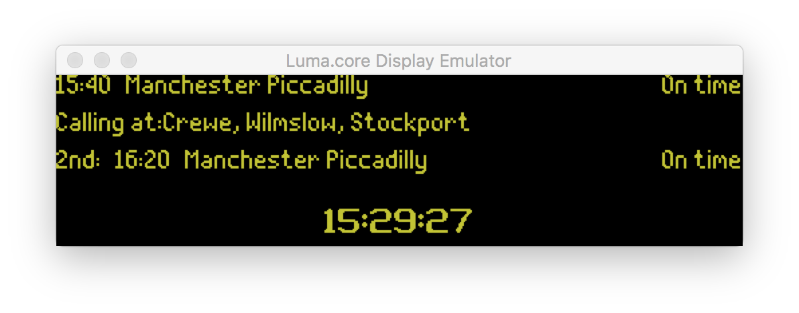

# Train Departure Pi


Experiment with showing real-time train departure info via an SSD1322 OLED screen attached to a Raspberry Pi.

 

#### Credits:

- Heavily inspired by [UK-Train-Departure-Display](https://github.com/ghostseven/UK-Train-Departure-Display) which forks [train-departure-screen](https://github.com/chrishutchinson/train-departure-screen).
- Font: [Dot-Matrix-Typeface](https://github.com/DanielHartUK/Dot-Matrix-Typeface) by [Daniel Hart](https://github.com/DanielHartUK).
- Using the [Luma](https://github.com/rm-hull/luma.core) library which provides a Pillow-compatible drawing canvas for the connected [SSD1322 Display](https://www.aliexpress.com/item/32949282762.html)
- Used the [luma.examples](https://github.com/rm-hull/luma.examples) repository's [CLI arguments parser](https://github.com/rm-hull/luma.examples/blob/master/examples/demo_opts.py) to initialise the different types of Luma devices.

# Usage

Copy the `.env.dist` file to `.env` and fill in the details from your [TransportAPI](https://www.transportapi.com/) subscription.

To run the docker image ([acornforth/train-departure-pi](https://hub.docker.com/repository/docker/acornforth/train-departure-pi)) with access to the Pi's GPIO and SPI interface:

```
docker run --env-file .env --device /dev/gpiomem --device /dev/spidev0.0 -it --rm acornforth/train-departure-pi
```

## Running with an Emulator

This is for if you don't have a screen connected via the SPI interface, or you just want to see the code running in an emulator.

Where `$IP` is your machine's local IP address:

```
xhost + $(hostname) # To enable XQuartz connections from your docker container
docker run --env-file .env -e DISPLAY=$IP:0 -v /tmp/.X11-unix:/tmp/.X11-unix acornforth/train-departure-pi python ./src/main.py --display pygame --width 256
```

For this to work on OS X, you'll need XQuartz as the docker container needs a way to access the MacOS window system.

```
brew cask install xquartz
```

> **Note**: The docker images are built to two architectures on CI using [docker buildx](https://github.com/docker/buildx). This is why the docker image will run on your Pi and on your machine. Supported architectures are:
> * `linux/amd64` (So you can run the code via the emulator on your shiny MacBook)
> * `linux/arm/v7` (So it runs on the Pi's ARM processors)

# Development

Clone the repository and run the following:

```
xhost + $(hostname) # To enable XQuartz connections from your docker container
docker-compose up -d --build && docker-compose logs -f
```

Or if you have a Python 3 environment set up:

```
export API_ID=<your-transportapi-id>
export API_KEY=<your-transportapi-key>
pip install -r requirements.txt
python ./src/main.py --display pygame --width 256 --height 64
```



# Hardware

The screen is a [SSD1322 chip OLED screen](https://www.aliexpress.com/item/32949282762.html).

## Notes on 4-SPI

The screen needs to be reconfigured to use 4SPI to work with the Luma library. From the comments in the Aliexpress link:

> The product arrived configured for protocol 8080. I unsoldered the resistance (R6) and I welded it on the support for the resistance in (R5) to use the 4SPI protocol

Also see [this blog post](https://www.balena.io/blog/build-a-raspberry-pi-powered-train-station-oled-sign-for-your-desk/#puttingittogether):

> Some displays have a solder-blob or zero-ohm resistor jumper on the back of the board that you may need to move in order to enable the display for SPI communication. If you don't get any output, check this first! In the case of my display it meant moving R6 to R5 to enable 4SPI as dictated by a small data table printed on the back of the display board.

In my case, I had to re-solder the R6 zero-ohm resistor to R5 (see top left of the circuit) to enable 4SPI, as shown on the table
printed on the bottom right of the circuit.


## Schematic Diagram

These [schematics](https://ae01.alicdn.com/kf/H10b015a4b529447089d8d74d15d6c118T.jpg) show the pin-outs for the SSD1322 display.

Connections required to connect the display to the GPIO in the Raspberry Pi:


I soldered a pin header to my display so that I that I could use jump wires to connect my display to a breakout board attached to my Pi. Look at that shoddy soldering! :)

 
